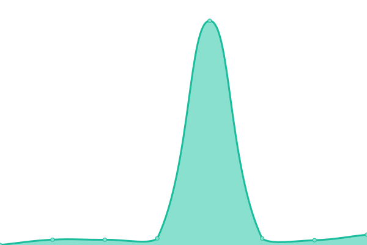
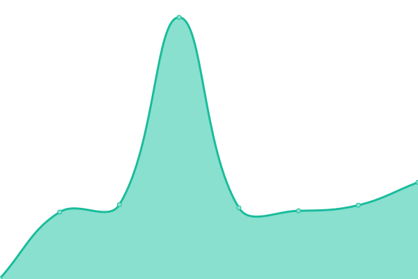

# [📈 Live Status](https://kenundrem.github.io/ccsuptime): <!--live status--> **🟩 All systems operational**

This repository contains the open-source uptime monitor and status page for [kenundrem](https://kenundrem.github.io/ccsuptime), powered by [Upptime](https://github.com/upptime/upptime).

With [Upptime](https://upptime.js.org), you can get your own unlimited and free uptime monitor and status page, powered entirely by a GitHub repository. We use [Issues](https://github.com/kenundrem/ccsuptime/issues) as incident reports, [Actions](https://github.com/kenundrem/ccsuptime/actions) as uptime monitors, and [Pages](https://kenundrem.github.io/ccsuptime) for the status page.

<!--start: status pages-->
<!-- This summary is generated by Upptime (https://github.com/upptime/upptime) -->
<!-- Do not edit this manually, your changes will be overwritten -->
<!-- prettier-ignore -->
| URL | Status | History | Response Time | Uptime |
| --- | ------ | ------- | ------------- | ------ |
|  [Google](https://www.google.com) | 🟩 Up | [google.yml](https://github.com/kenundrem/ccsuptime/commits/HEAD/history/google.yml) | 

 88ms
     
 | 

<a href="https://kenundrem.github.io/ccsuptime/history/google">100.00%</a>
    

|  [Microsoft 365](https://status.cloud.microsoft/) | 🟩 Up | [microsoft-365.yml](https://github.com/kenundrem/ccsuptime/commits/HEAD/history/microsoft-365.yml) | 

 130ms
     
 | 

<a href="https://kenundrem.github.io/ccsuptime/history/microsoft-365">99.79%</a>
    

|  [Adobe](https://status.adobe.com/) | 🟩 Up | [adobe.yml](https://github.com/kenundrem/ccsuptime/commits/HEAD/history/adobe.yml) | 

 141ms
     
 | 

<a href="https://kenundrem.github.io/ccsuptime/history/adobe">100.00%</a>
    

|  [Apple Services](https://www.apple.com/support/systemstatus/) | 🟩 Up | [apple-services.yml](https://github.com/kenundrem/ccsuptime/commits/HEAD/history/apple-services.yml) | 

 113ms
     
 | 

<a href="https://kenundrem.github.io/ccsuptime/history/apple-services">100.00%</a>
    

|  [AWS](https://health.aws.amazon.com/health/status) | 🟩 Up | [aws.yml](https://github.com/kenundrem/ccsuptime/commits/HEAD/history/aws.yml) | 

 299ms
     
 | 

<a href="https://kenundrem.github.io/ccsuptime/history/aws">100.00%</a>
    

|  [Odoo](https://www.saashub.com/odoo-status) | 🟩 Up | [odoo.yml](https://github.com/kenundrem/ccsuptime/commits/HEAD/history/odoo.yml) | 

 621ms
     
 | 

<a href="https://kenundrem.github.io/ccsuptime/history/odoo">100.00%</a>
    

|  [Zoom](https://www.zoomstatus.com/) | 🟩 Up | [zoom.yml](https://github.com/kenundrem/ccsuptime/commits/HEAD/history/zoom.yml) | 

 311ms
     
 | 

<a href="https://kenundrem.github.io/ccsuptime/history/zoom">100.00%</a>
    

|  [Google Cloud Services](https://status.cloud.google.com/) | 🟩 Up | [google-cloud-services.yml](https://github.com/kenundrem/ccsuptime/commits/HEAD/history/google-cloud-services.yml) | 

 400ms
     
 | 

<a href="https://kenundrem.github.io/ccsuptime/history/google-cloud-services">100.00%</a>
    

|  [Microsoft Azure](https://azure.status.microsoft/en-us/status) | 🟩 Up | [microsoft-azure.yml](https://github.com/kenundrem/ccsuptime/commits/HEAD/history/microsoft-azure.yml) | 

 423ms
     
 | 

<a href="https://kenundrem.github.io/ccsuptime/history/microsoft-azure">100.00%</a>
    

<!--end: status pages-->

[**Visit our status website →**](https://kenundrem.github.io/ccsuptime)

## 📄 License

- Powered by: [Upptime](https://github.com/upptime/upptime)
- Code: [MIT](./LICENSE) © [Anand Chowdhary](https://anandchowdhary.com), supported by [Pabio](https://pabio.com)
- Data in the `./history` directory: [Open Database License](https://opendatacommons.org/licenses/odbl/1-0/)
